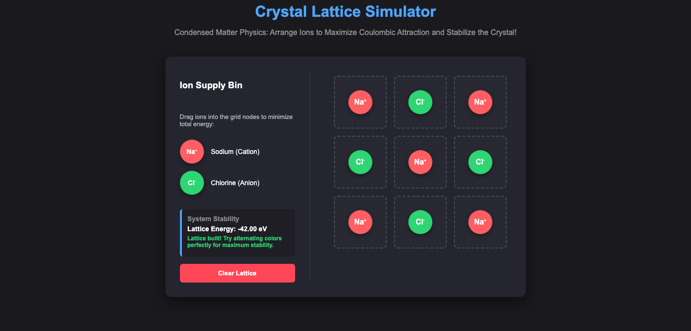

# Crystal Lattice Simulator


[](LICENSE)

**Deployed at: [jeelswami.github.io/crystal-lattice-simulation](https://jeelswami.github.io/crystal-lattice-simulation/)**

## What is this?

An interactive, single-page web simulation that teaches the fundamentals of condensed matter physics and solid-state chemistry. You build a 2D cross-section of a sodium chloride (NaCl) crystal by dragging ions onto a lattice grid, and the app scores the stability of your arrangement in real time.



## Why did I build it?

Ionic crystal structure is usually taught with static diagrams, but the reason NaCl adopts the rock-salt structure is an energy argument, and energy arguments make more sense when you can experiment with them. Placing ions by hand and watching the energy readout respond turns "opposite charges alternate" from a fact to memorize into a result you discover.

## The physics

- **Ionic bonding and crystal structure.** Solids adopt the arrangement that minimizes total energy. The simulator replicates the cubic rock-salt configuration, where Na+ cations and Cl- anions alternate on the lattice.
- **Coulombic lattice energy.** Stability is modeled with simplified Coulomb's law indicators: adjacent opposite ions contribute attraction (E < 0), adjacent identical ions contribute repulsion (E > 0). The dashboard reports the running total in electron-volts as you place each ion, and recognizes a perfectly alternating lattice.

## How do I run it?

Use the live version linked above, or run it locally:

```bash
git clone https://github.com/JeelSwami/crystal-lattice-simulation.git
open crystal-lattice-simulation/index.html
```

No build step, no dependencies: any modern browser works.

## Features

- **Drag and drop.** Drag unlimited ions from the supply bin into grid positions, using native HTML5 drag-and-drop.
- **Real-time energy engine.** Every placement immediately updates the lattice energy and the stability verdict.
- **Clear and retry.** Reset the lattice instantly to test alternative arrangements, including deliberately unstable ones.

## Key technologies

Vanilla JavaScript, semantic HTML5 and CSS3. The physics engine, the drag-and-drop handling and the nearest-neighbor energy bookkeeping live in one file with zero external dependencies.

## Project structure

```text
├── index.html      # Simulator layout, interface, and physics engine
├── style.css       # Responsive grid layout and ion styling
├── screenshot.png  # README preview
└── README.md
```

## License

[CC BY-NC 4.0](LICENSE): free for personal study, teaching and non-commercial use with attribution to [Jeel Swami](https://github.com/JeelSwami).
